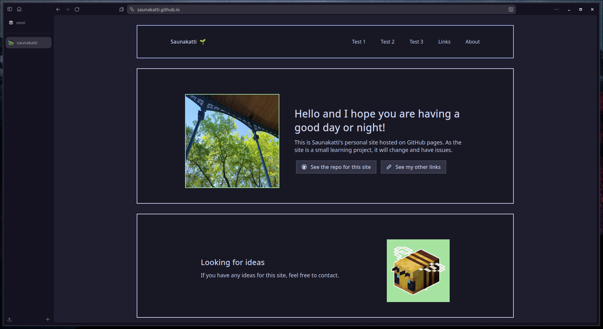
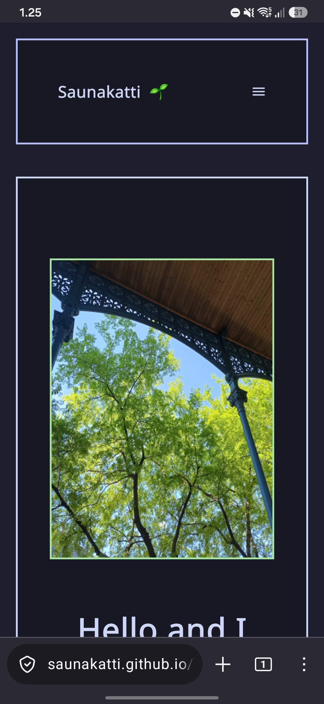

# Saunakatti's Personal Site

My personal site for links and other stuff. Intended as a learning project for css, html etc.
Uses Mocha pallette of [Catppuccin](https://github.com/catppuccin/catppuccin) for theming. The site also uses (or at least tries to use) [Nerd Fonts](https://github.com/ryanoasis/nerd-fonts) for cool icons. 

> [!Note]
> GitHub pages means no backend.

### [saunakatti.github.io](https://saunakatti.github.io/)

---

### List of ideas
- Some small vague personal About and about the site

- (Done partially, TODO: import file from repo, change old ones to class names)
  Rework usage of icons by importing "https://www.nerdfonts.com/assets/css/webfont.css"
   - This would help when looking at
    code without a Nerd Font

- Take inspo from indie websites

- Add blog with recent post(s) on homepage

- Make good codeblocks with prismjs

- Major cleanup at some point
  - Make IDs and Classes more understandable and remove unneeded ones
  - Remove pointless configuraton
  - Split into sections and add more comments

- (Added, light theme might change) Add dark/light mode switch with latte flavour as light theme

- (Future) Add picture gallery

- (Future) Add more animations

- (Future) Add library for read books to force me to read more

- (Future) Add no javascript mode for users not using javascript.

<!-- gaming related stuff, smp??, fsmp blog? -->

<!-- Could use Atabook to add a guestbook?>

<!-- Make a button 88 x 31>

<!-- Notebook section>

<!-- New colour palette >

